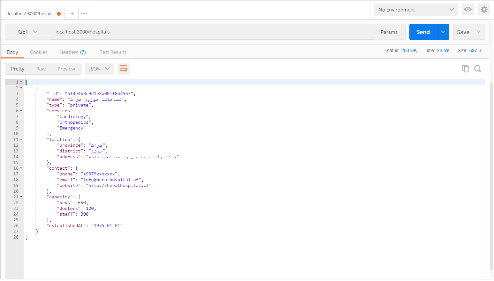
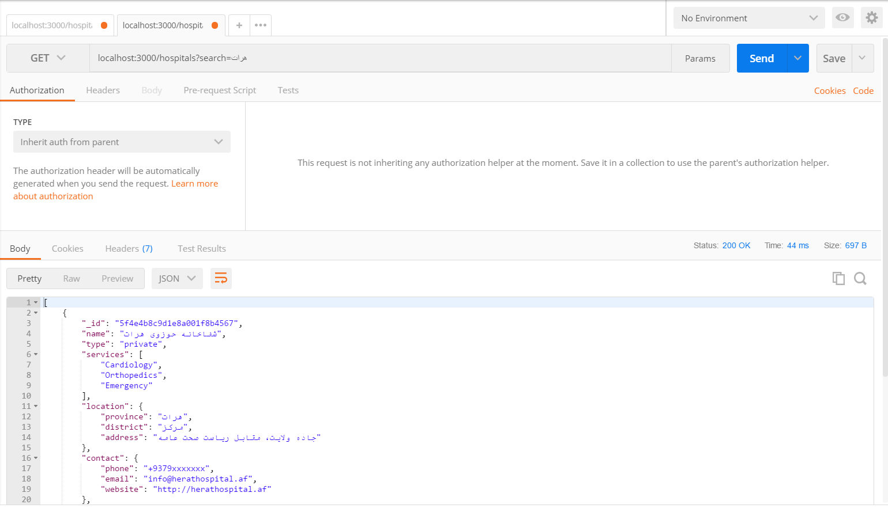
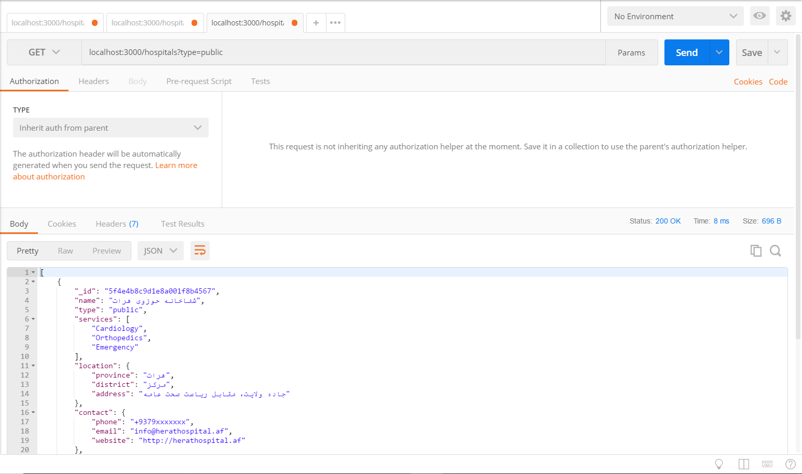
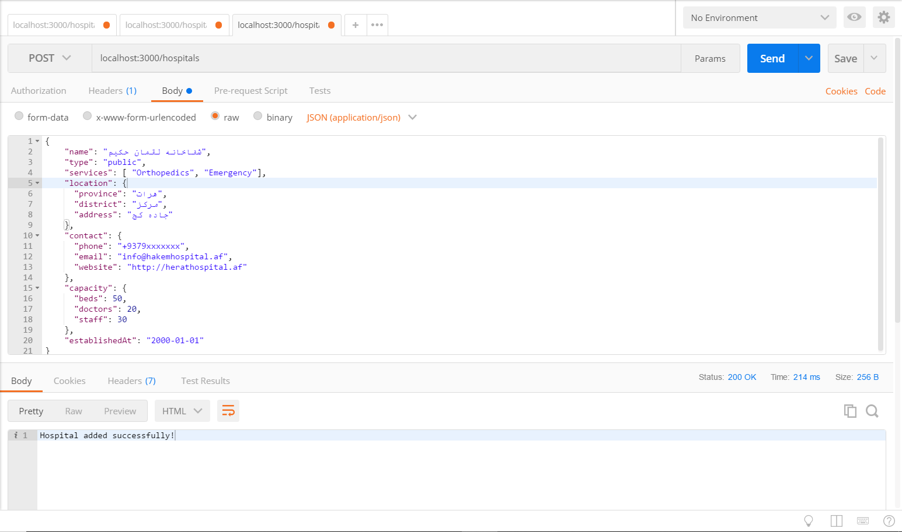
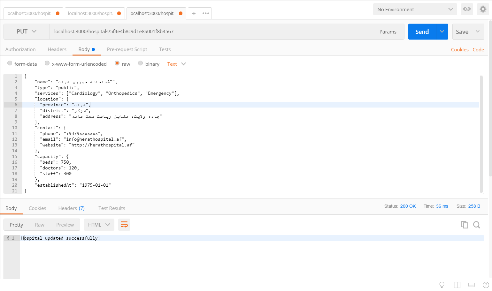
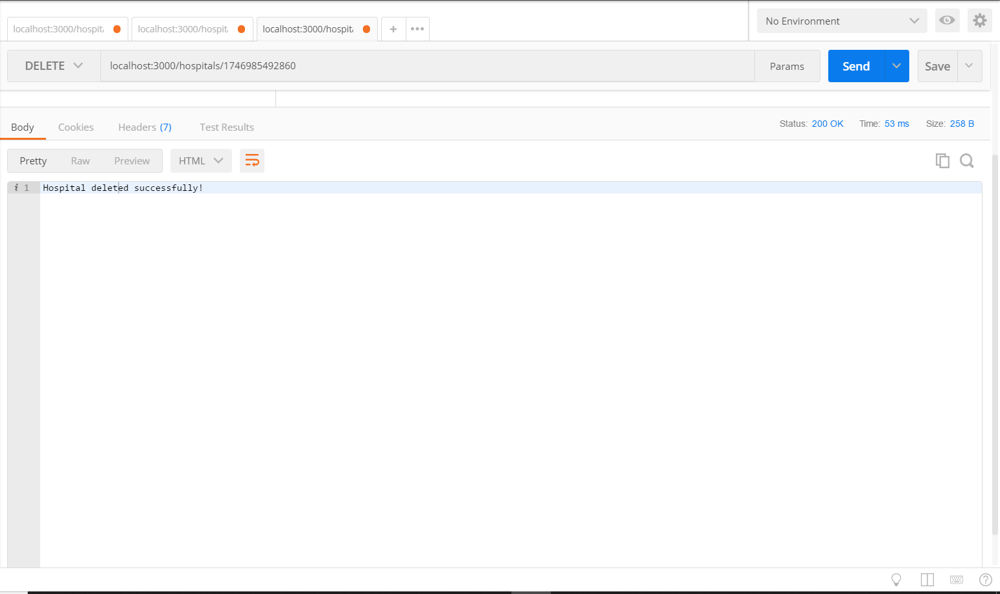
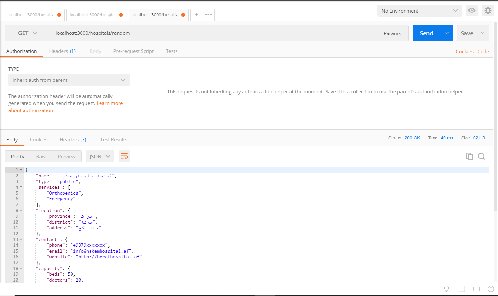

# 🏥 Hospital API - Node.js & Express Project

This project is a simple RESTful API built using **Node.js** and **Express** that allows you to manage hospital data (stored in a local `data.json` file). It supports CRUD operations and filtering/searching capabilities.

## 🚀 Features

- View all hospitals
- Filter hospitals by type
- Search hospitals by keyword
- View a random hospital
- Add a new hospital
- View hospital details by ID
- Update hospital by ID
- Delete hospital by ID

## 🚀 Live Demo
   [Click here to view the live demo](https://your-live-demo-link.com)
## 📦 Requirements

- Node.js (v14+ recommended)
- npm or yarn

## 🔧 Installation

1. Clone the repository:
   ```bash
   git clone https://github.com/SaeqaSultani/Hospital-API.git
   cd hospital-api
   
2. Install dependencies:
   ```bash
   npm install

3. Make sure you have a data.json file in the root directory. Here's a basic example:
   ```bash
    [
      {
        "_id": "1",
        "name": "City Hospital",
        "type": "General",
        "location": "Main Street"
      }
   ]   

4. Start the server:
   ```bash
   node index.js
5. The server will run at:
   ```bash
   http://localhost:3000

## 📡 API Endpoints
  | Method | Endpoint            | Description                               |
  | ------ | ------------------- | ----------------------------------------- |
  | GET    | `/hospitals`        | Get all hospitals (with optional filters) |
  | GET    | `/hospitals/random` | Get a random hospital                     |
  | GET    | `/hospitals/:id`    | Get a hospital by ID                      |
  | POST   | `/hospitals`        | Add a new hospital                        |
  | PUT    | `/hospitals/:id`    | Update a hospital by ID                   |
  | DELETE | `/hospitals/:id`    | Delete a hospital by ID                   |


## 🔍 Filters & Query Parameters (GET /hospitals)
    -   ```type```: Filter hospitals by type (e.g., General, Specialist)
    -  ```search```: Search by keyword in any text field
    Example:
    ```bash
    /hospitals?type=Public&search=city

## 📷 Screenshots
   
   
   
   
   
   
   

## ✍️ Author
   👤 **SaeqaSultani**
   - GitHub: [SaeqaSultani](https://github.com/SaeqaSultani)
   - LinkedIn: [SaeqaSultani](https://www.linkedin.com/in/saeqa-sultani/)

## 🤝 Contributing <a name="contributing"></a>

Contributions, issues, and feature requests are welcome!

Feel free to check the [issues page](https://github.com/SaeqaSultani/Hospital-API/issues).

## ⭐️ Show your support <a name="support"></a>

> Write a message to encourage readers to support your project
If you like this project...

